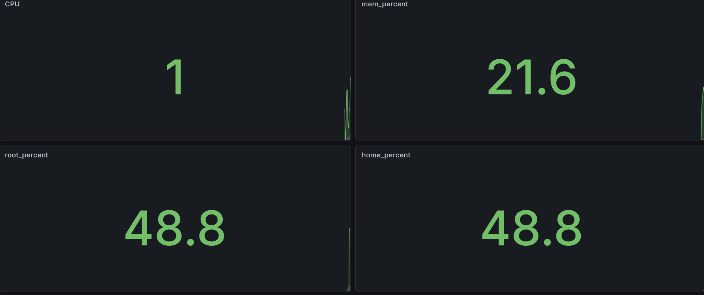

# Project 2 — Enterprise Health Monitor

Production-grade deployment of a Flask metrics app across a 4-node bare-metal Kubernetes cluster. Built to mirror a real enterprise environment — multi-OS nodes, full CI/CD pipeline, automated provisioning, and centralized monitoring.

## Stack
- **App:** Python, Flask, psutil, prometheus-client
- **Container:** Docker
- **Provisioning:** Ansible — configures all VMs, installs Docker, Kubernetes, joins nodes to cluster
- **Orchestration:** Kubernetes (kubeadm) — 4-node cluster across Ubuntu 22, Ubuntu 26, CentOS, Arch Linux
- **Deployment:** Helm chart manages all Kubernetes manifests
- **CI/CD:** Jenkins pipeline — builds Docker image, pushes to DockerHub, deploys via Helm
- **Monitoring:** Prometheus scrapes `/metrics` via ServiceMonitor, Grafana displays CPU, memory, disk dashboard

## Cluster
| Role | OS | IP |
|---|---|---|
| Control Plane | Ubuntu 22.04 | 192.168.0.124 |
| Worker | Arch Linux | 192.168.0.38 |
| Worker | CentOS | 192.168.0.171 |
| Worker | Ubuntu 26.04 | 192.168.0.3 |

## Structure
```sh
├── app/app.py # Flask app — collects and exposes metrics 
├── Dockerfile # Container definition 
├── health-monitor-p2/ # Helm chart 
├── vm_setup.yml # Ansible — provisions all VMs and joins cluster 
├── jenkins_setup.yml # Ansible — automates Jenkins container setup 
├── Jenkinsfile # Jenkins pipeline 
├── servicemonitor.yaml # Prometheus ServiceMonitor 
├── ansible.cfg # Ansible config 
├── inventory # Host inventory 
├── host_vars/ # Per-node variables 
└── files/ # Helper scripts (kube install, firewall, flannel)
```
## Dashboard

